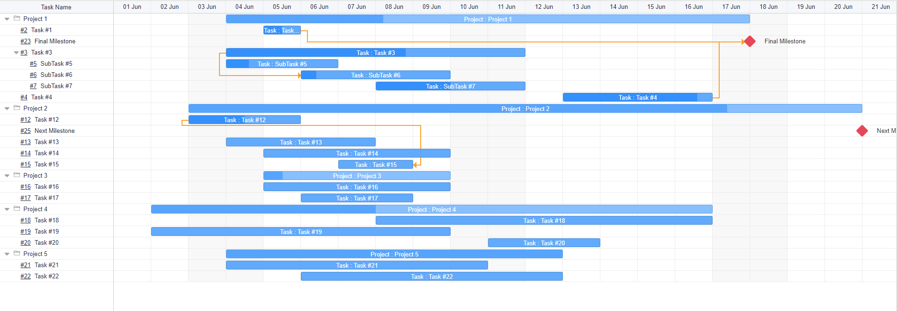
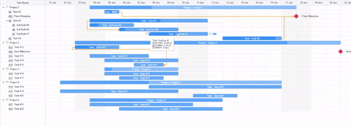
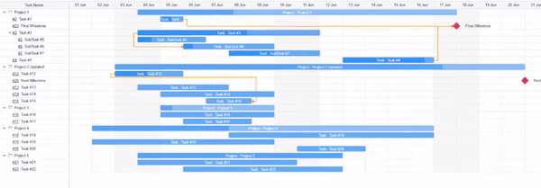
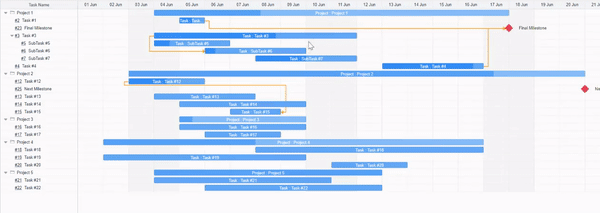
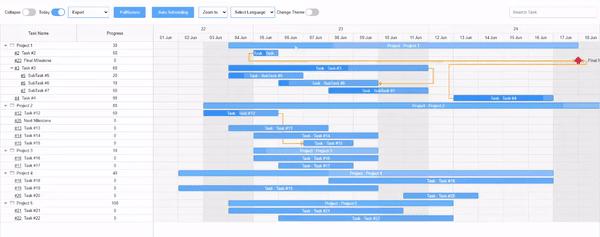

# javascriptgantt Chart Library Documentation  
  

## Introduction  
Welcome to the documentation for [javascriptgantt](https://sunilsolankiji.github.io/javascriptgantt/) Chart Library. This library provides a powerful set of tools and functionalities to create interactive Gantt charts for project management. This documentation will guide you through the installation process, usage instructions, and available features of the library.   
  

## Table of Contents 
- [Installation](#installation)
- [Getting Started](#getting-started) 
- [Features](#features)   
    
---  
  

## Installation   
  
To integrate the Gantt Chart Library, adhere to the steps below:  
  
  1. Download the library files from our website or repository.  
  2. Integrate the library files (`gantt.js` and `gantt.css`) into your project.  
  3. Link the library files in your HTML file.  
  4. You're now ready to start using the javascriptgantt Chart Library!    

    
  
---  
  

## Getting Started ##
To create a basic Gantt Chart, follow these steps:     

**Step 1:** Add the files:   
~~~html

<link rel="stylesheet" href="gantt.css" type="text/css">
~~~  

**Step 2:** Insert the markup:  
~~~html

~~~  

**Step 3:** Invoke the Gantt Chart Library using JavaScript, targeting the container element, and define your tasks, dependencies, and duration.  

~~~js
let element = document.getElementById("gantt_here"); 
let gantt = new javascriptgantt(element);  
gantt.options.columns = [
  {
    name: "text",
    width: 245,
    min_width: 80,
    max_width: 300,
    tree: true,
    label: "Name",
    resize: true,
    template: (task) => {
      return `${task.parent == 0 ? task.text : task.subject}`;
    },
  },
 ...
];

gantt.options.data = [
  { id: 1, text: "Project 1", parent: 0, progress: 50 },
  {
    id: 2,
    text: "Task #1",
    start_date: "05-05-2023",
    end_date: "05-05-2023",
    parent: 1,
    progress: 60,
  },
  ...
];

gantt.options.scales = [
  {
    unit: "week",
    step: 1,
    format: (t) => {
      return "%d %F";
    },
  },
  {
    unit: "day",
    step: 1,
    format: "%d %D",
  },
];

gantt.options.links = [
  { id: 1, source: 1, target: 2, type: 0 },
  { id: 2, source: 2, target: 3, type: 1 },
  { id: 3, source: 3, target: 4, type: 2 },
  { id: 4, source: 12, target: 15, type: 3 },
];  

gantt.render();
~~~   

**Note:** Remember to call `gantt.render();` whenever you wish to visualize the updated data.  

[Live demo](https://sunilsolankiji.github.io/javascriptgantt/)      

**Complete Documentation:** [javascriptgantt Documentation](https://sunilsolankiji.github.io/js-gantt-docs/)  
  
  ---  
  

## Features     

  * **Task Linking:** Four types - finish-to-start, start-to-start, finish-to-finish, start-to-finish.      

    

  * **Drag and Drop:** Shift multiple tasks horizontally and vertically.    
  * **Filtering:** Conveniently filter out tasks.    
  * **Tooltips:** Additional insights via tooltips.  
  * **Grid:** Columns in the grid are fully customizable.  
  * **Customization:** Modify the time scale, task edit form, and much more.    
    
     

  * **Task Progress:** Update task progress via dragging or manually set the percentage.    
  * **Exports:** Get your charts in PDF, PNG, or Excel formats.    
  * **Zoom Levels:** Multiple timeline views - hour, day, week, month, quarter, and year.  
  * **Full Screen:** View your Gantt in full screen for an immersive experience.    
  * **Task Management:** Expand, collapse, add markers, modify, or delete tasks.     
  * **Auto Scheduling:** Tasks are automatically scheduled.   
  * **Date Selection:** Easily select start and end dates through drag and drop. 
  * **Mouse Scroll:** Scroll timeline using mouse click.   
  * **Aesthetics:** Customize the task colors via a color picker.   

         
    
  * **Localization:** Multilingual support to cater to a global audience.   
  * **Themes:** Dark mode for those late-night work sessions.  

    
  
  You can see the full list of features in the [documentation](https://sunilsolankiji.github.io/js-gantt-docs/)   
    
        
  [Try it Yourself:](https://stackblitz.com/edit/js-bdaa47?file=index.js): Dive into hands-on examples and truly understand the potential of the library.    
    
  ---
